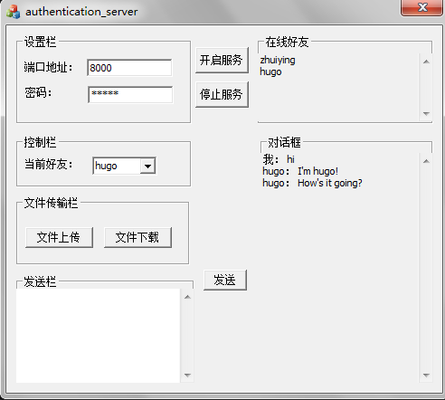
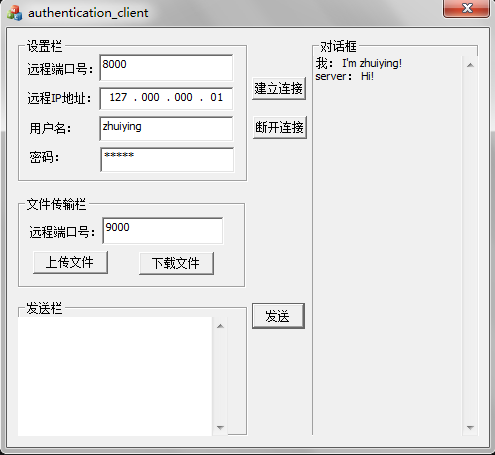

 <h2>
<a name="authentication" class="anchor" href="#authentication"></a>authentication</h2>

&nbsp;&nbsp;一个Windows平台上基于c/s模型的聊天软件（服务器与客户机直接聊天，非聊天室），具备登录认证、文字聊天和文件传输功能。不定期更新中...

  

<h2>
<a name="general-description" class="anchor" href="#general-description"></a>1 总体说明(general description)</h2>

<h3><a name="function" class="anchor" href="#function"></a>1.1 项目功能(function)</h3>

&nbsp;&nbsp;一个Windows平台上基于c/s模型的聊天软件（服务器与客户机直接聊天，非聊天室），具备<strong>登录认证</strong>、<strong>文字聊天</strong>和<strong>文件传输</strong>功能。

 

<h3><a name="realization" class="anchor" href="#realization"></a>1.2 项目实现(realization)</h3>

&nbsp;&nbsp;本项目来源于《网络软件设计》课程设计，基于<strong>MFC</strong>实现，主体框架基于MFC<strong>异步消息机制</strong>。</h3>
  

<h2>
<a name="model-intro" class="anchor" href="#model-intro"></a>2 模块介绍(model introduction)</h2>

<h3><a name="authentication" class="anchor" href="#authentication"></a>2.1 认证模块(authentication)</h3>

&nbsp;&nbsp;认证模块使用类似CHAP似的认证机制，通过"三次握手"完成认证过程。具体过程如下：

<ul class="task-list">
<li>（1）服务器向客户机发送认证请求（一串数据）；</li>
<li>（2）客户机向服务器返回对应计算结果；</li>
<li>（3）服务器验证计算结果正确与否，给予回复，并决定是否为该客户机服务。</li>
</ul>
 

<h3><a name="chat" class="anchor" href="#chat"></a>2.2 文字聊天模块(chat)</h3>

&nbsp;&nbsp;文字聊天模块，就是简单的传输文字而已…

 

<h3><a name="transfer-file" class="anchor" href="#transfer-file"></a>2.3 文件传输模块(file transfer)</h3>

&nbsp;&nbsp;文件传输模块使用有别于控制信息及聊天信息交互用端口的另外的端口（好拗口…），通过用户名实现两对连接的关联。

  

<h2>
<a name="model-intro" class="anchor" href="#model-intro"></a>3 目前的不足(what to be done)</h2>

3.1	认证模块时序不够完善，简单说就是没有进行超时处理。认证过程的计算目前是模拟的。

 

3.2	文字聊天模块一样时序不够完善。在界面上显示聊天信息时不能进行自动换行。

 

3.3	文件传输模块一样时序不够完善。文件浏览器功能还未实现，即用户还不能自主选择传输什么文件。文件重名情况下保存接收文件问题（目前是直接粗暴的append）。文件传输模式只实现上传模式（服务器上传和客户机上传）。

 

<h2>
<a name="presentation" class="anchor" href="#presentation"></a>4 图片展示(presentation)</h2>
<h3>
	
服务器界面
</h3>
&nbsp;&nbsp;&nbsp;&nbsp;</img>
    

<h3>
	
客户机界面
</h3>
&nbsp;&nbsp;&nbsp;&nbsp;</img>
    